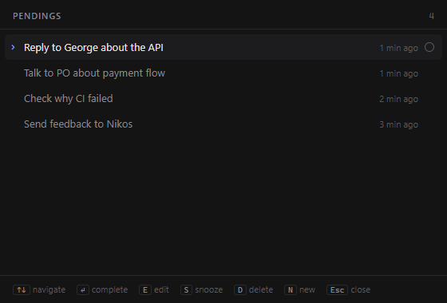

# Quick Pending

A zero-friction inbox for the small things you need to remember while working.

> reply to George about the API · talk to PO about payment flow · check why CI failed

Press a shortcut from any app, type, hit Enter, and you're back where you were.
Quick Pending lives in the system tray and starts with your computer, so it's
always one keystroke away.

**[Download for Windows](https://github.com/andreaslamperis/quick-pending/releases/latest)**



## Features

- **Quick Capture**: a small floating input opened by a global shortcut. Enter
  saves it and returns focus to the app you were in.
- **Pending List**: a keyboard-first palette to review, complete, edit, delete and
  snooze items.
- **Runs in the background** from the tray, launches at startup (can be turned off
  in Settings), and only ever runs once.
- **Local and private**: everything is stored in a SQLite file on your machine.
  No accounts, no cloud.
- **Never loses a capture**: if saving fails, the text stays put and Enter retries.
- Dark, light or system theme.

## Shortcuts

Global shortcuts work from any app. Change them in **Settings → Shortcuts**: click
**Change** and press the combination you want. Each needs `Ctrl`, `Alt` or `Win`
plus a key, and any of them can be cleared.

| Default | Action |
| --- | --- |
| `Ctrl+Shift+Space` (`Cmd+Shift+Space` on macOS) | Capture Pending |
| not set | Open Pendings (main window; press again to hide it) |
| `Ctrl+Alt+P` (`Cmd+Option+P` on macOS) | Pending List |

In the Pending List:

| Key | Action |
| --- | --- |
| `↑` `↓` | Navigate |
| `Enter` | Complete |
| `E` | Edit (`Enter` saves, `Esc` cancels) |
| `D` | Delete (asks for confirmation) |
| `S` | Snooze: in 1 hour, this evening, tomorrow, next week |
| `N` | New pending |
| `Esc` | Close |

In the tray, **double-click** the icon to open the main window, or **right-click**
it for Capture Pending, Open Pendings, History, Settings and Quit.

## Install (Windows)

Download the installer (`Quick-Pending_<version>_x64-setup.exe`) from the
**[latest release](https://github.com/andreaslamperis/quick-pending/releases/latest)**
and run it. It installs per user, so it doesn't need admin rights. To build the
installer yourself, see [Development](#development).

The installer isn't code-signed, so Windows SmartScreen will warn on first run:
choose **More info → Run anyway**.

## Development

Prerequisites: [Node.js](https://nodejs.org), [Rust](https://rustup.rs) and the
[Tauri prerequisites](https://tauri.app/start/prerequisites/) for your OS (on
Windows: Visual Studio's "Desktop development with C++" workload).

```bash
npm install
npm run tauri dev      # run the app with hot reload
npm run tauri build    # build the release app and installer
```

On Windows, run these from PowerShell or cmd rather than Git Bash: Git Bash's
`link` command shadows the MSVC linker and the Rust build fails.

The dev build and an installed copy share the same app identity and database. If
the installed app is running, quit it from the tray first, or `tauri dev` just
brings up the installed one.

Rust tests (database layer):

```bash
cd src-tauri && cargo test
```

## Project structure

```
src/                     React UI (one bundle, three windows)
  App.tsx                main window: Pendings / History / Settings
  CaptureWindow.tsx      Quick Capture bar
  palette/               Pending List palette
  api.ts                 typed wrappers for the Rust commands
src-tauri/src/
  db.rs                  all SQLite access, with unit tests
  commands.rs            Tauri commands for pendings
  panels.rs              floating windows (capture bar, palette)
  tray.rs                tray icon and menu
  shortcuts.rs           customizable global shortcuts
  settings.rs            launch at startup, theme
```

Data is stored in the app data folder, e.g.
`%APPDATA%\com.quickpending.app\quick-pending.db` on Windows.

## License

[MIT](LICENSE)
